Continuous Glucose Monitoring with Freestyle Libre
================
Richard Sprague
2019-05-24

See [Continous Glucose Monitoring: Start
Here](http://richardsprague.com/notes/continuous-glucose-monitoring/)

I’ve been tracking my glucose levels 24 x 7 using a continuous glucose
monitor from Abbott Labs called the [Freestyle
Libre](https://www.freestylelibre.us/index.html).

View a Shiny version of my current data at
<https://personalscience.shinyapps.io/librelink/>.
\[[Source](https://github.com/richardsprague/cgm/tree/master/librelink)\]

Read (and edit\!) my [Continuous Glucose Monitoring Hackers
Guide](https://docs.google.com/document/d/11DFx0E-ZQ-r_D1SqXvMtvkDCjx6j7NevrE43WSaKyJE/edit?usp=sharing)
for details for how to get started, plus as many resources as I know
about other apps and links that you might find useful for beginning your
own CGM analysis.

This is a short R script I use for my analysis.

-----

## Prerequisites

Besides the working sensor, to run this script you’ll need:

  - A registered account on Freestyle’s official site:
    [libreview.com](https://www2.libreview.com/)
  - Data downloaded from the Libreview site. (I download it and convert
    to XLSX format in the file “Librelink.xlsx”)
  - A separate activity file to register your food, exercise, sleep, and
    other events. (Another XLSX file I call “Activity.XLSX”)

See examples of all my raw data files in the
[librelink](https://github.com/richardsprague/cgm/tree/master/librelink)
directory.

One you have downloaded the raw Librelink data and created the activity
file, you must read the results into two dataframes:

`libre_raw` : the raw output from a Librelink CSV file. You could just
read.csv straight from the CSV if you like.

`activity_raw`: your file containing the metadata about whatever you’d
like to track. The following script assumes you’ll have variables for
`Sleep`, `Exercise`, `Food`, and a catch-all called `Event`.

Now clean up the data and then set up a few other useful variables. Be
careful about time zones: the raw data comes as UTC time, so you’ll need
to convert everything to your local time zone if you want the following
charts to match.

``` r
library(tidyverse)
library(lubridate)
library(ggthemes)

activity_raw$Start <- activity_raw$Start %>% lubridate::parse_date_time(order = "ymd HMS",tz = "US/Pacific")
activity_raw$End <- activity_raw$End %>% lubridate::parse_date_time(order = "ymd HMS", tz = "US/Pacific")


glucose <- libre_raw %>% select(time = "Meter Timestamp", 
                                scan = "Scan Glucose(mg/dL)",
                                hist = "Historic Glucose(mg/dL)",
                                strip = "Strip Glucose(mg/dL)",
                                food = "Notes")

#glucose$time <- readr::parse_datetime(libre_raw$`Meter Timestamp`,locale = locale(tz="US/Pacific"))

glucose$time <- as_datetime(libre_raw$`Meter Timestamp`, tz = "US/Pacific")
# 
glucose$value <- dplyr::if_else(is.na(glucose$scan),glucose$hist,glucose$scan)

# apply correction for faulty 2019-01-08 sensor
#glucose$value <- dplyr::if_else(glucose$time>as_datetime("2019-01-08"),glucose$value+35,glucose$value)

# apply correction for faulty 2019-03-24 sensor
#glucose$value <- dplyr::if_else(glucose$time>as_datetime("2019-03-23"),glucose$value+35,glucose$value)


glucose_raw <- glucose

# libre_raw$`Meter Timestamp` %>% lubridate::parse_date_time(order = "ymd HMS",tz = "US/Pacific")
```

Set up a few convenience functions.

``` r
# a handy ggplot object that draws a band through the "healthy" target zones across the width of any graph:
glucose_target_gg <-   geom_rect(aes(xmin=as.POSIXct(-Inf,  origin = "1970-01-01"),
                xmax=as.POSIXct(Inf,  origin= "1970-01-01"),
                ymin=100,ymax=140),
            alpha = 0.01, fill = "#CCCCCC",
            inherit.aes = FALSE)


# show glucose levels between start and end times
cgm_display <- function(start=lubridate::now()-lubridate::hours(18),
                        end=now(),
                        activity_df=activity_raw,
                        glucose_df=glucose_raw) {
  ggplot(glucose_df ,aes(x=time,y=value)) + geom_line(size=2, color = "red")+ 
  geom_point(stat = "identity", aes(x=time,y=strip), color = "blue")+
  glucose_target_gg + 
  geom_rect(data=activity_df %>% dplyr::filter(Activity == "Sleep") %>%
              select(xmin = Start,xmax = End) %>% cbind(ymin = -Inf, ymax = Inf),
            aes(xmin=xmin,xmax=xmax,ymin=ymin,ymax=ymax),
            fill="red",
            alpha=0.2,
            inherit.aes = FALSE) +
  geom_rect(data=activity_df %>% dplyr::filter(Activity == "Exercise") %>%
              select(xmin = Start,xmax = End),
            aes(xmin=xmin,xmax=xmax,ymin=-Inf,ymax=Inf),
            fill="blue",
            alpha=0.2,
            inherit.aes = FALSE) +
   geom_vline(xintercept = activity_df %>% 
               dplyr::filter(Activity == "Event" & Comment == "awake") %>% select("Start") %>% unlist(),
             color = "green") +
  geom_vline(xintercept = activity_df %>% 
               dplyr::filter(Activity == "Food") %>% select("Start") %>% unlist(),
             color = "yellow")+
  geom_text(data = activity_df %>%
              dplyr::filter(Activity == "Food") %>% select("Start","Comment") ,
            aes(x=Start,y=50, angle=90, hjust = FALSE,  label = Comment),
            size = 6) +
  labs(title = "Glucose (mg/dL)", subtitle = start) +  theme(plot.title = element_text(size=22))+
    scale_x_datetime(limits = c(start,end),
                     date_labels = "%m/%d %H:%M",
                     timezone = "US/Pacific")
  
}

# returns a dataframe giving all glucose values within "timelength" of a specific activity
food_effect <- function( foodlist = c("Oatmeal","Oatmeal w cinnamon"), activity_df = activity_raw, glucose_df = glucose_raw, timelength = lubridate::hours(2)){
  #food_df <- activity_df %>% dplyr::filter(str_detect(str_to_lower(activity_df$Comment),pattern = foodname))
  food_df <- activity_df %>% dplyr::filter(Comment %in% foodlist)
  food_df$Comment <- paste0(food_df$Comment,rownames(food_df))
  food_df_interval <- interval(food_df$Start,food_df$Start + hours(1))
  food_glucose <- glucose_df %>% dplyr::filter(apply(sapply(glucose_df$time,function(x) x %within% food_df_interval),2,any))
 # food_glucose <- glucose_df %>% dplyr::filter(sapply(glucose_df$time,function(x) x %within% food_df_interval))
  f <- cbind(food_glucose[1,],experiment = "test")
  
  a = NULL
  
  for(i in food_df$Start){
    i_time <- as_datetime(i, tz = "US/Pacific")
    # < rbind(i,a)
    g <- glucose_df %>% dplyr::filter(time %within% interval(i_time - minutes(10), i_time + timelength))
    #print(g)
    p = match(as_datetime(i),food_df$Start)
    f <- rbind(f,cbind(g,experiment = food_df$Comment[p]))
  }
  foods_experiment <- f[-1,]
  foods_experiment
}
```

View the last couple days of the dataset:

``` r
startDate <- now() - days(2) #min(glucose$time)

#cgm_display(startDate,now()-days(6))

cgm_display(startDate,startDate + days(2))
```

<!-- -->

Here’s just for a single day. Note that the commented-out lines will let
you output to a PDF file if you like.

``` r
#pdf("icecream.pdf", width = 11, height = 8.5)
cgm_display(start = min(glucose_raw$time),min(glucose_raw$time)+hours(24))
```

<!-- -->

``` r
#dev.off()
```

The final full day of the dataset:

``` r
cgm_display(start = max(glucose_raw$time)-days(1), end = max(glucose_raw$time))
```

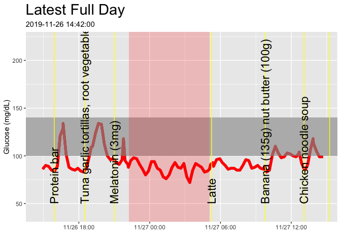<!-- -->

## Food types

Here’s how I look when eating specific foods:

<!-- --><!-- -->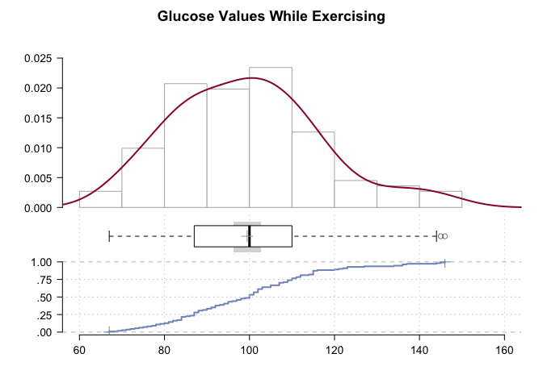<!-- -->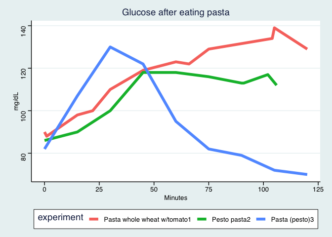<!-- --><!-- -->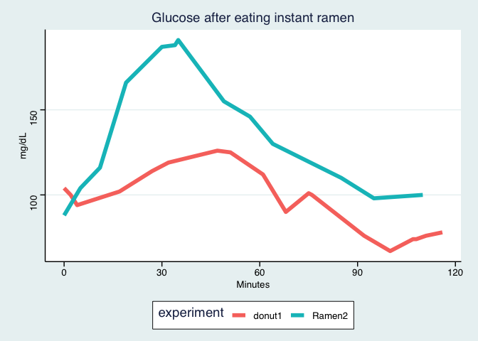<!-- -->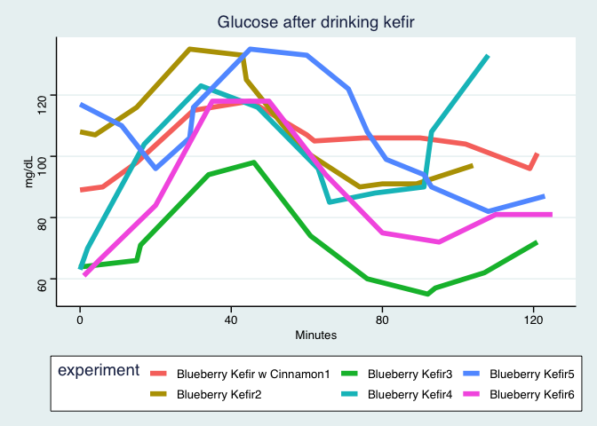<!-- -->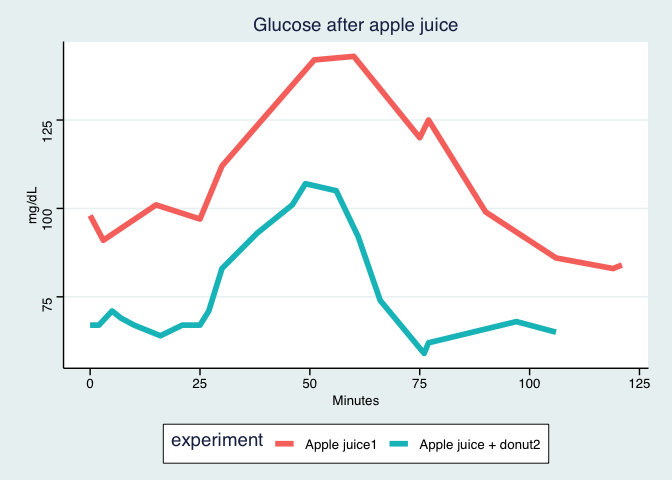<!-- --><!-- --><!-- -->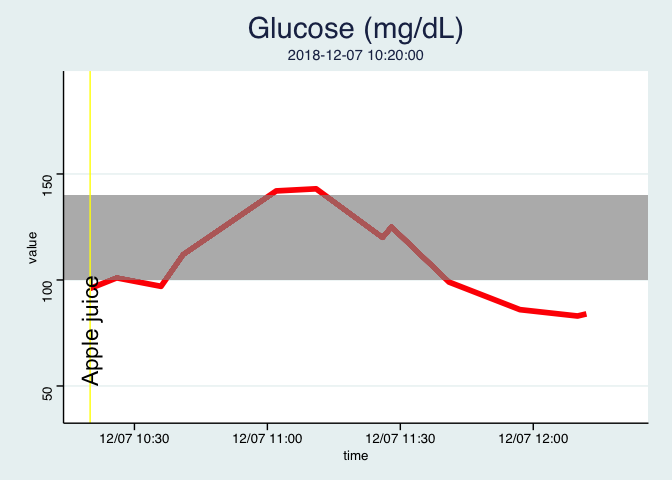<!-- --><!-- -->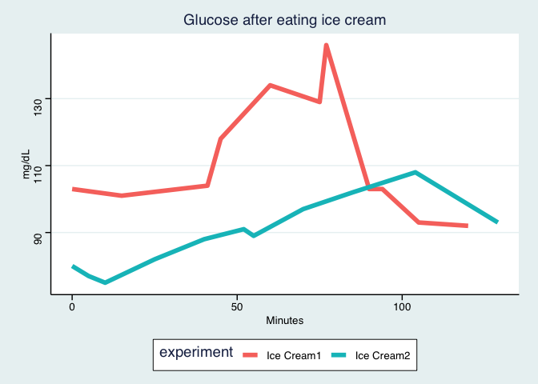<!-- -->

    ## Scale for 'x' is already present. Adding another scale for 'x', which
    ## will replace the existing scale.

<!-- --><!-- --><!-- -->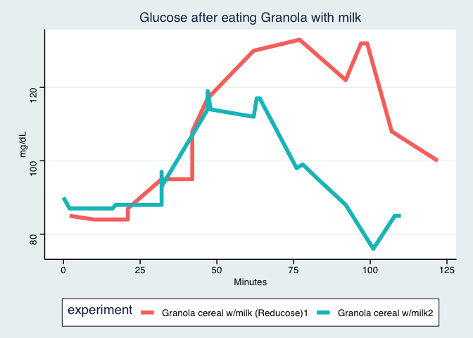<!-- -->

## Basic Statistics

What is my average glucose level while sleeping?

``` r
library(lubridate)

options(scipen = 999)

# all sleep intervals, using the lubridate function lubridate::interval
# sleep_intervals <- interval(activity_raw %>% dplyr::filter(Activity == "Sleep") %>% select(Start)
#                             %>% unlist() %>% as_datetime(),
#                             activity_raw %>% dplyr::filter(Activity == "Sleep") %>% select(End) 
#                             %>% unlist() %>% as_datetime())

activity_intervals <- function(activity_raw_df, activity_name){
  interval(activity_raw_df %>% dplyr::filter(Activity == activity_name) %>% select(Start)
                            %>% unlist() %>% as_datetime(),
                            activity_raw_df %>% dplyr::filter(Activity ==activity_name) %>% select(End) 
                            %>% unlist() %>% as_datetime())
}


glucose %>% filter(apply(sapply(glucose$time,
                                function(x) x %within% activity_intervals(activity_raw,"Sleep")),2,any)) %>% select(value) %>% 
  DescTools::Desc(main = "Glucose Values While Sleeping")
```

    ## ------------------------------------------------------------------------- 
    ## Describe . (tbl_df, tbl, data.frame):
    ## 
    ## data.frame:  1826 obs. of  1 variables
    ## 
    ##   Nr  ColName  Class    NAs  Levels
    ##   1   value    numeric  .          
    ## 
    ## 
    ## ------------------------------------------------------------------------- 
    ## Glucose Values While Sleeping
    ## 
    ##   length       n    NAs  unique     0s   mean  meanCI
    ##    1'826   1'826      0      89      0  78.15   77.47
    ##           100.0%   0.0%           0.0%          78.83
    ##                                                      
    ##      .05     .10    .25  median    .75    .90     .95
    ##    51.00   58.50  71.00   78.50  86.00  96.00  102.00
    ##                                                      
    ##    range      sd  vcoef     mad    IQR   skew    kurt
    ##    92.00   14.83   0.19   11.12  15.00  -0.02    0.96
    ##                                                      
    ## lowest : 40.0 (31), 41.0 (5), 42.0 (4), 43.0 (3), 44.0 (3)
    ## highest: 125.0 (2), 126.0 (2), 129.0, 131.0 (2), 132.0 (2)

<!-- -->

``` r
glucose %>% filter(apply(sapply(glucose$time,
                                function(x) !(x %within% activity_intervals(activity_raw,"Sleep"))),
                         2,
                         any)) %>% select(value) %>% 
  DescTools::Desc(main = "Glucose Values While Awake")
```

    ## ------------------------------------------------------------------------- 
    ## Describe . (tbl_df, tbl, data.frame):
    ## 
    ## data.frame:  7082 obs. of  1 variables
    ## 
    ##   Nr  ColName  Class    NAs        Levels
    ##   1   value    numeric  95 (1.3%)        
    ## 
    ## 
    ## ------------------------------------------------------------------------- 
    ## Glucose Values While Awake
    ## 
    ##   length      n    NAs  unique     0s    mean  meanCI
    ##    7'082  6'987     95     134      0   88.62   88.16
    ##           98.7%   1.3%           0.0%           89.07
    ##                                                      
    ##      .05    .10    .25  median    .75     .90     .95
    ##    60.00  67.00  77.00   86.00  99.00  114.00  125.00
    ##                                                      
    ##    range     sd  vcoef     mad    IQR    skew    kurt
    ##   151.00  19.35   0.22   16.31  22.00    0.72    1.40
    ##                                                      
    ## lowest : 40.0 (33), 41.0 (5), 42.0 (5), 43.0 (3), 44.0 (7)
    ## highest: 174.0, 182.0 (2), 187.0, 188.0, 191.0

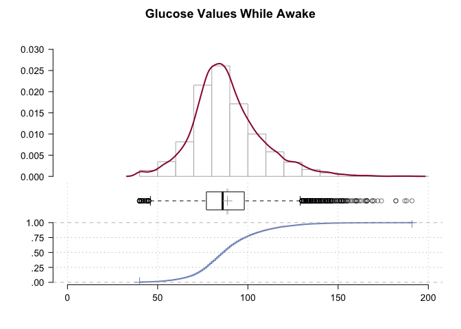<!-- -->

``` r
glucose %>% filter(apply(sapply(glucose$time,
                                function(x) x %within% activity_intervals(activity_raw,"Exercise")),2,any)) %>% select(value) %>% 
  DescTools::Desc(main = "Glucose Values While Exercising")
```

    ## ------------------------------------------------------------------------- 
    ## Describe . (tbl_df, tbl, data.frame):
    ## 
    ## data.frame:  34 obs. of  1 variables
    ## 
    ##   Nr  ColName  Class    NAs       Levels
    ##   1   value    numeric  1 (2.9%)        
    ## 
    ## 
    ## ------------------------------------------------------------------------- 
    ## Glucose Values While Exercising
    ## 
    ##   length      n    NAs  unique      0s    mean  meanCI
    ##       34     33      1      28       0   91.76   85.33
    ##           97.1%   2.9%            0.0%           98.18
    ##                                                       
    ##      .05    .10    .25  median     .75     .90     .95
    ##    69.60  71.20  78.00   87.00  100.00  114.80  120.80
    ##                                                       
    ##    range     sd  vcoef     mad     IQR    skew    kurt
    ##    77.00  18.12   0.20   19.27   22.00    0.77    0.13
    ##                                                       
    ## lowest : 67.0, 69.0, 70.0, 71.0, 72.0
    ## highest: 110.0, 116.0, 120.0, 122.0, 144.0

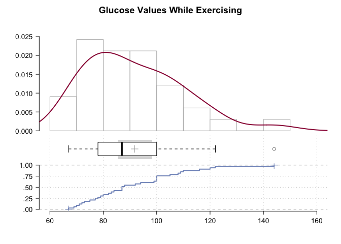<!-- -->
