I've been tracking my glucose levels 24 x 7 using a continuous glucose monitor from Abbot Labs called the [Freestyle Libre](https://www.freestylelibre.us/index.html). 

Read (and edit!) my [Continuous Glucose Monitoring Hackers Guide](https://docs.google.com/document/d/11DFx0E-ZQ-r_D1SqXvMtvkDCjx6j7NevrE43WSaKyJE/edit?usp=sharing) for details for how to get started, plus as many resources as I know about other apps and links that you might find useful for beginning your own CGM analysis.

This is a short R script I use for my analysis.

---

First we read the data and put it into a tidy format in two dataframes:

`libre_raw` : the raw output from a Librelink CSV file. You could just read.csv straight from the CSV if you like.

`activity_raw`: your file containing the metadata about whatever you'd like to track. The following script assumes you'll have variables for `Sleep`, `Exercise`, `Food`, and a catch-all called `Event`. 


Now clean up the data and then set up a few other useful variables.


```r
library(tidyverse)
library(lubridate)
library(ggthemes)

activity_raw$Start <- activity_raw$Start %>% lubridate::parse_date_time(order = "ymd HMS",tz = "US/Pacific")
activity_raw$End <- activity_raw$End %>% lubridate::parse_date_time(order = "ymd HMS", tz = "US/Pacific")


glucose <- libre_raw %>% select(time = "Meter Timestamp", 
                                scan = "Scan Glucose(mg/dL)",
                                hist = "Historic Glucose(mg/dL)",
                                strip = "Strip Glucose(mg/dL)",
                                food = "Notes")

#glucose$time <- readr::parse_datetime(libre_raw$`Meter Timestamp`,locale = locale(tz="US/Pacific"))

glucose$time <- as_datetime(libre_raw$`Meter Timestamp`, tz = "US/Pacific")
# 
glucose$value <- dplyr::if_else(is.na(glucose$scan),glucose$hist,glucose$scan)

# apply correction for faulty 2019-01-08 sensor
#glucose$value <- dplyr::if_else(glucose$time>as_datetime("2019-01-08"),glucose$value+35,glucose$value)

glucose_raw <- glucose

# libre_raw$`Meter Timestamp` %>% lubridate::parse_date_time(order = "ymd HMS",tz = "US/Pacific")
```

Set up a few convenience functions.


```r
# a handy ggplot object that draws a band through the "healthy" target zones across the width of any graph:
glucose_target_gg <-   geom_rect(aes(xmin=as.POSIXct(-Inf,  origin = "1970-01-01"),
                xmax=as.POSIXct(Inf,  origin= "1970-01-01"),
                ymin=100,ymax=140),
            alpha = 0.01, fill = "#CCCCCC",
            inherit.aes = FALSE)


# show glucose levels between start and end times
cgm_display <- function(start=lubridate::now()-lubridate::hours(18),
                        end=now(),
                        activity_df=activity_raw,
                        glucose_df=glucose_raw) {
  ggplot(glucose_df ,aes(x=time,y=value)) + geom_line(size=2, color = "red")+ 
  geom_point(stat = "identity", aes(x=time,y=strip), color = "blue")+
  glucose_target_gg + 
  geom_rect(data=activity_df %>% dplyr::filter(Activity == "Sleep") %>%
              select(xmin = Start,xmax = End) %>% cbind(ymin = -Inf, ymax = Inf),
            aes(xmin=xmin,xmax=xmax,ymin=ymin,ymax=ymax),
            fill="red",
            alpha=0.2,
            inherit.aes = FALSE) +
  geom_rect(data=activity_df %>% dplyr::filter(Activity == "Exercise") %>%
              select(xmin = Start,xmax = End),
            aes(xmin=xmin,xmax=xmax,ymin=-Inf,ymax=Inf),
            fill="blue",
            alpha=0.2,
            inherit.aes = FALSE) +
   geom_vline(xintercept = activity_df %>% 
               dplyr::filter(Activity == "Event" & Comment == "awake") %>% select("Start") %>% unlist(),
             color = "green") +
  geom_vline(xintercept = activity_df %>% 
               dplyr::filter(Activity == "Food") %>% select("Start") %>% unlist(),
             color = "yellow")+
  geom_text(data = activity_df %>%
              dplyr::filter(Activity == "Food") %>% select("Start","Comment") ,
            aes(x=Start,y=50, angle=90, hjust = FALSE,  label = Comment),
            size = 6) +
  labs(title = "Glucose (mg/dL)", subtitle = start) +  theme(plot.title = element_text(size=22))+
    scale_x_datetime(limits = c(start,end),
                     date_labels = "%m/%d %H:%M",
                     timezone = "US/Pacific")
  
}

# returns a dataframe giving all glucose values within "timelength" of a specific activity
food_effect <- function( foodlist = c("Oatmeal","Oatmeal w cinnamon"), activity_df = activity_raw, glucose_df = glucose_raw, timelength = lubridate::hours(2)){
  #food_df <- activity_df %>% dplyr::filter(str_detect(str_to_lower(activity_df$Comment),pattern = foodname))
  food_df <- activity_df %>% dplyr::filter(Comment %in% foodlist)
  food_df$Comment <- paste0(food_df$Comment,rownames(food_df))
  food_df_interval <- interval(food_df$Start,food_df$Start + hours(1))
  food_glucose <- glucose_df %>% dplyr::filter(apply(sapply(glucose_df$time,function(x) x %within% food_df_interval),2,any))
 # food_glucose <- glucose_df %>% dplyr::filter(sapply(glucose_df$time,function(x) x %within% food_df_interval))
  f <- cbind(food_glucose[1,],experiment = "test")
  
  a = NULL
  
  for(i in food_df$Start){
    i_time <- as_datetime(i, tz = "US/Pacific")
    # < rbind(i,a)
    g <- glucose_df %>% dplyr::filter(time %within% interval(i_time - minutes(10), i_time + timelength))
    #print(g)
    p = match(as_datetime(i),food_df$Start)
    f <- rbind(f,cbind(g,experiment = food_df$Comment[p]))
  }
  foods_experiment <- f[-1,]
  foods_experiment
}
```


View the last couple days of the dataset:


```r
startDate <- now() - days(2) #min(glucose$time)

#cgm_display(startDate,now()-days(6))

cgm_display(startDate,startDate + days(2))
```

<!-- -->

Here's just for a single day:


```r
#pdf("icecream.pdf", width = 11, height = 8.5)
cgm_display(start = min(glucose_raw$time),min(glucose_raw$time)+hours(24))
```

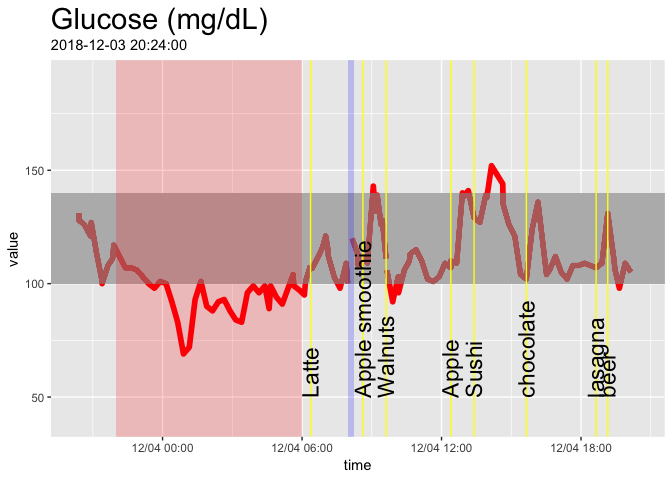<!-- -->

```r
#dev.off()
```


The final full day of the dataset:


```r
cgm_display(start = max(glucose_raw$time)-days(1), end = max(glucose_raw$time))
```

<!-- -->


## Food types

Here's how I look when eating specific foods:

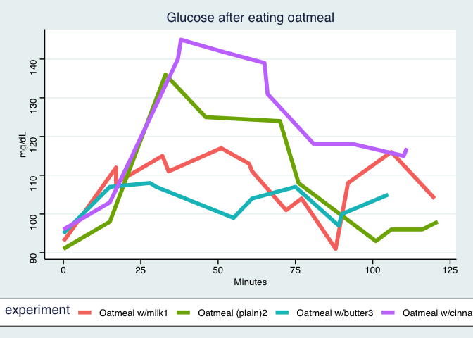<!-- -->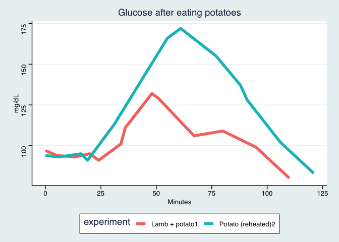<!-- -->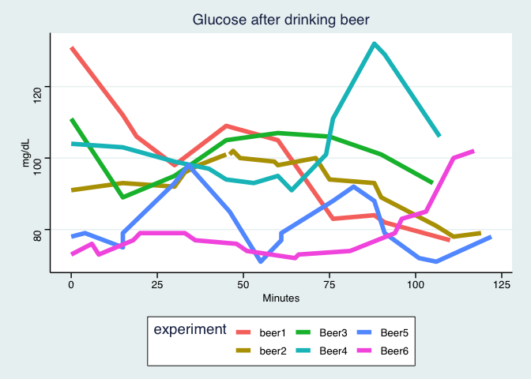<!-- -->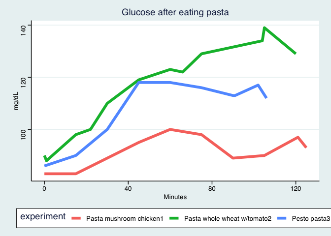<!-- -->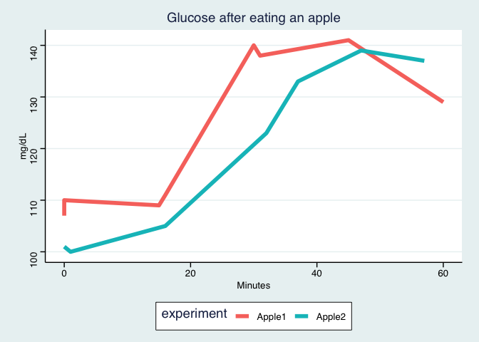<!-- -->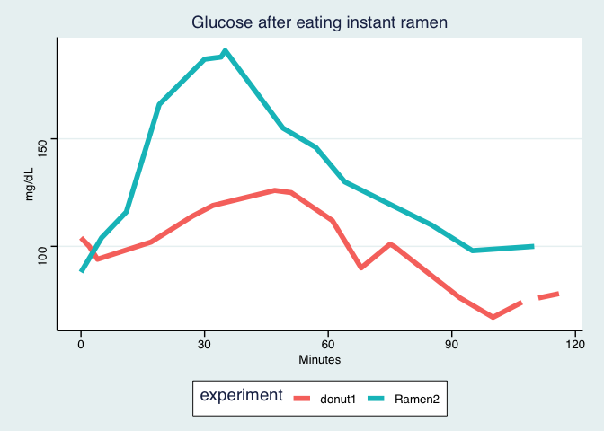<!-- -->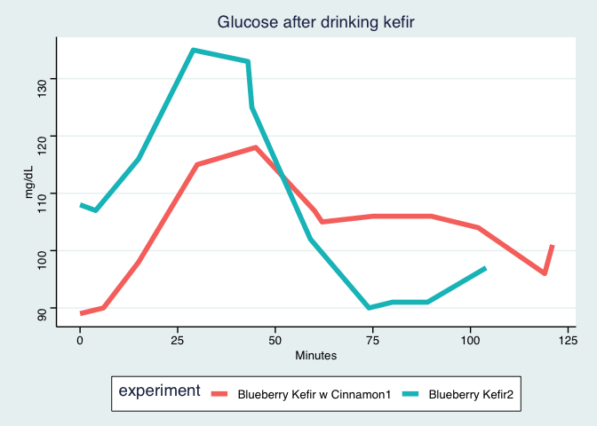<!-- --><!-- -->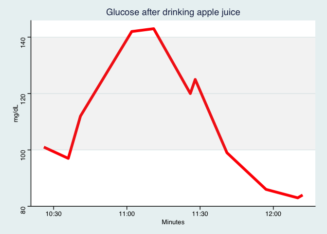<!-- --><!-- --><!-- --><!-- -->

```
## Scale for 'x' is already present. Adding another scale for 'x', which
## will replace the existing scale.
```

<!-- -->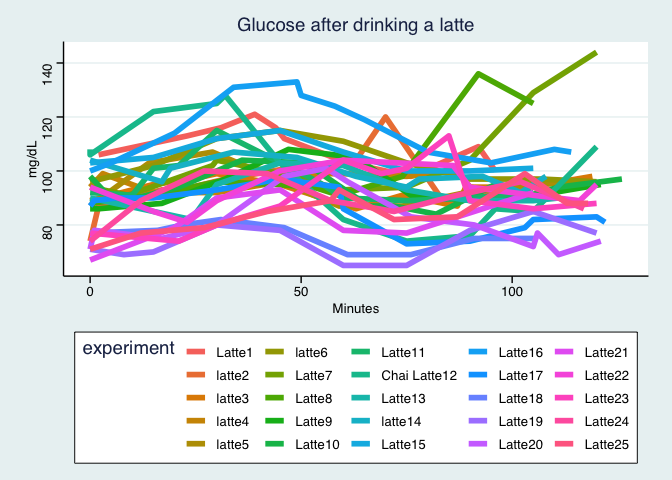<!-- -->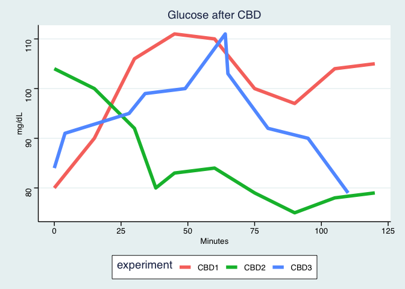<!-- -->

Table: Glucose Changes from drinking a latte

experiment      max(value)   min(value)   change
-------------  -----------  -----------  -------
Latte1                  NA           NA       NA
latte2                 120           74       46
latte3                  99           86       13
latte4                 100           90       10
latte5                 107           87       20
latte6                 115           96       19
Latte7                 144           91       53
Latte8                 136           88       48
Latte9                 108           86       22
Latte10                104           84       20
Latte11                115           89       26
Chai Latte12           128           74       54
Latte13                103           82       21
latte14                107           92       15
Latte15                115          100       15
Latte16                133          100       33
Latte17                 97           73       24
Latte18                 82           69       13
Latte19                 85           65       20
Latte20                101           69       32
Latte21                 93           67       26
Latte22                104           81       23
Latte23                113           74       39
Latte24                100           74       26
Latte25                 99           71       28

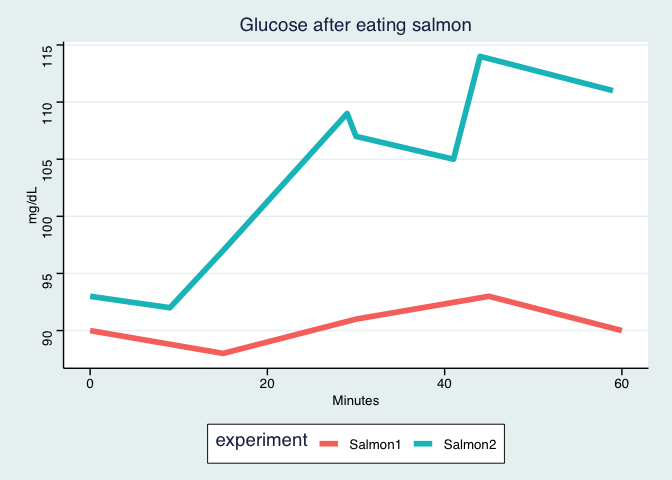<!-- -->


## Basic Statistics

What is my average glucose level while sleeping?


```r
library(lubridate)

options(scipen = 999)

# all sleep intervals, using the lubridate function lubridate::interval
# sleep_intervals <- interval(activity_raw %>% dplyr::filter(Activity == "Sleep") %>% select(Start)
#                             %>% unlist() %>% as_datetime(),
#                             activity_raw %>% dplyr::filter(Activity == "Sleep") %>% select(End) 
#                             %>% unlist() %>% as_datetime())

activity_intervals <- function(activity_raw_df, activity_name){
  interval(activity_raw_df %>% dplyr::filter(Activity == activity_name) %>% select(Start)
                            %>% unlist() %>% as_datetime(),
                            activity_raw_df %>% dplyr::filter(Activity ==activity_name) %>% select(End) 
                            %>% unlist() %>% as_datetime())
}


glucose %>% filter(apply(sapply(glucose$time,
                                function(x) x %within% activity_intervals(activity_raw,"Sleep")),2,any)) %>% select(value) %>% 
  DescTools::Desc(main = "Glucose Values While Sleeping")
```

```
## ------------------------------------------------------------------------- 
## Describe . (tbl_df, tbl, data.frame):
## 
## data.frame:	742 obs. of  1 variables
## 
##   Nr  ColName  Class    NAs  Levels
##   1   value    numeric  .          
## 
## 
## ------------------------------------------------------------------------- 
## Glucose Values While Sleeping
## 
##   length       n    NAs  unique     0s   mean  meanCI
##      742     742      0      80      0  79.98   78.95
##           100.0%   0.0%           0.0%          81.00
##                                                      
##      .05     .10    .25  median    .75    .90     .95
##    54.00   62.00  72.00   81.00  88.00  97.00  102.00
##                                                      
##    range      sd  vcoef     mad    IQR   skew    kurt
##    92.00   14.22   0.18   11.86  16.00  -0.15    0.89
##                                                      
## lowest : 40.0 (3), 41.0 (4), 42.0 (3), 43.0 (2), 44.0
## highest: 120.0, 121.0, 125.0, 131.0, 132.0
```

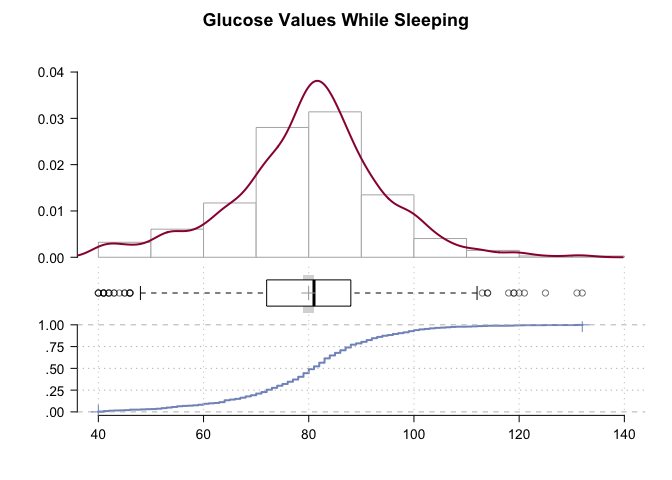<!-- -->

```r
glucose %>% filter(apply(sapply(glucose$time,
                                function(x) !(x %within% activity_intervals(activity_raw,"Sleep"))),
                         2,
                         any)) %>% select(value) %>% 
  DescTools::Desc(main = "Glucose Values While Awake")
```

```
## ------------------------------------------------------------------------- 
## Describe . (tbl_df, tbl, data.frame):
## 
## data.frame:	2787 obs. of  1 variables
## 
##   Nr  ColName  Class    NAs        Levels
##   1   value    numeric  17 (0.6%)        
## 
## 
## ------------------------------------------------------------------------- 
## Glucose Values While Awake
## 
##   length      n    NAs  unique      0s    mean  meanCI
##    2'787  2'770     17     120       0   91.23   90.50
##           99.4%   0.6%            0.0%           91.95
##                                                       
##      .05    .10    .25  median     .75     .90     .95
##    63.00  69.00  79.00   90.00  102.00  117.00  127.00
##                                                       
##    range     sd  vcoef     mad     IQR    skew    kurt
##   151.00  19.41   0.21   16.31   23.00    0.57    1.04
##                                                       
## lowest : 40.0 (3), 41.0 (4), 42.0 (3), 43.0 (2), 44.0 (5)
## highest: 166.0 (2), 172.0, 187.0, 188.0, 191.0
```

<!-- -->

```r
glucose %>% filter(apply(sapply(glucose$time,
                                function(x) x %within% activity_intervals(activity_raw,"Exercise")),2,any)) %>% select(value) %>% 
  DescTools::Desc(main = "Glucose Values While Exercising")
```

```
## ------------------------------------------------------------------------- 
## Describe . (tbl_df, tbl, data.frame):
## 
## data.frame:	31 obs. of  1 variables
## 
##   Nr  ColName  Class    NAs       Levels
##   1   value    numeric  1 (3.2%)        
## 
## 
## ------------------------------------------------------------------------- 
## Glucose Values While Exercising
## 
##   length      n    NAs  unique      0s    mean  meanCI
##       31     30      1      27       0   92.20   85.11
##           96.8%   3.2%            0.0%           99.29
##                                                       
##      .05    .10    .25  median     .75     .90     .95
##    69.45  70.90  77.25   89.50  103.75  116.40  121.10
##                                                       
##    range     sd  vcoef     mad     IQR    skew    kurt
##    77.00  18.98   0.21   20.02   26.50    0.67   -0.20
##                                                       
## lowest : 67.0, 69.0, 70.0, 71.0, 72.0
## highest: 110.0, 116.0, 120.0, 122.0, 144.0
```

<!-- -->


